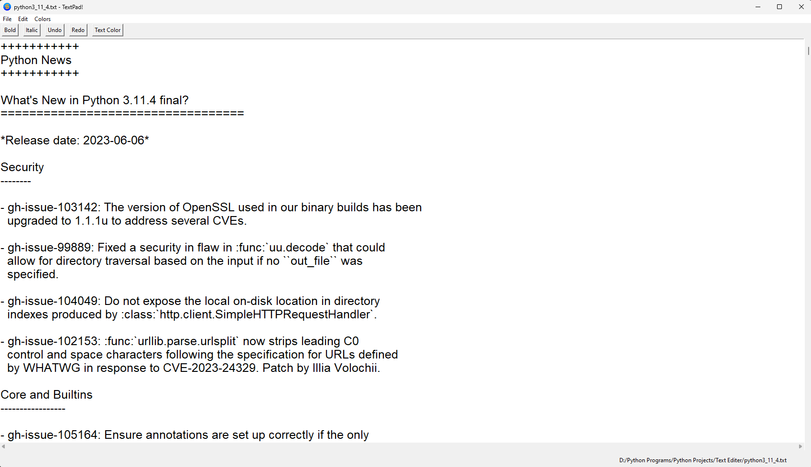

## 
***Introducing New Samarth's Project - Text Editor***

---

---
### 
💡 ***This is a Multi-Functioning Text Editor, a Basic Project in Python*** 💡

### ➡️ **<u>Features are:-</u>**
- #### ***_file menu_*** 
- #### ***_edit menu_*** 
- #### ***_color menu_*** 
- #### ***_open file_*** 
- #### ***_save file_*** 
- #### ***_save as file_*** 
- #### ***_cut text_*** 
- #### ***_copy text_*** 
- #### ***_paste text_*** 
- #### ***_undo text_*** 
- #### ***_redo text_*** 
- #### ***_undo button_*** 
- #### ***_redo button_*** 
- #### ***_bold text_*** 
- #### ***_bold button_*** 
- #### ***_italic text_*** 
- #### ***_italic button_*** 
- #### ***_color selected text_*** 
- #### ***_color all text_*** 
- #### ***_change background color_*** 
- #### ***_print file_*** 
- #### ***_select all_*** 
- #### ***_clear all_*** 
- #### ***_horizontal scroll_*** 
- #### ***_vertical scroll_*** 

---

### ⚒️ **<u>Python Module Used Here:-</u>** 
- #### ***_Tkinter_***
- #### ***_Win32api_***
- #### ***_Tkinter filedialog_***
- #### ***_Tkinter font_***
- #### ***_Tkinter colorchooser_***

---

## 
***YouTude Video : https://youtu.be/aAYAPcsGCs0***

